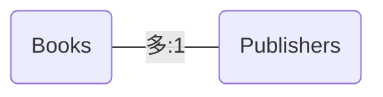
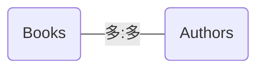

## よく使用するrailsコマンド
- `generate(g)`: テンプレート機能を使用してプログラムのひな型を生成する
- `console(c)`: Railsアプリケーションの環境を読み込んだうえでirbを起動する
- `server(s)`: 開発用アプリケーションサーバを起動する
- `test(t)`: アプリケーションのテストを実行する
- `test:system`: アプリケーションのシステムテストを実行する
- `dbconsole(db)`: 設定ファイルに定義されている接続情報を使用してDBへ接続し、コンソールを起動する
- `new`: Railsアプリケーションを作成する
- `db:create`: データベースを作成する
- `db:drop`: データベースを削除する
- `db:migrate`: マイグレーションファイルの内容のテーブル定義をDBに反映させる
- `db:seed`: `db/seed.rb`の内容を実行する
- `db:setup`: データベースを作成し、スキーマの読み込みとシードデータの読み込みを行う
- `routes`: URLとControllerを紐づけているルーティング情報を出力する

---

## ActivateRecordによるモデルの役割
1. データベースと接続し、データベースのレコードとActiveRecordオブジェクトを結びつける役割
2. ビジネスロックの実装的な振る舞いに関する、バリデーションやレコード保存などに実行する様々なコールバックなどを実行する役割
---
## CRUD操作との対応表
| 動詞 | 具体的な内容 | ActiveRecordの対応するメソッド |
| ---- | ---- | ---- |
| Create | レコードを作る | Book.create, Book#save |
| Read | レコードを参照する | Book.find, Book.all |
| Update | レコードを更新する | Book#save, Book#update_attributes |
| Delete | レコードを削除する | Book#delete, Book#destroy |

---

## ActiveRecordのメソッドの対応表
| ActiveRecordのメソッド | SQL | 説明 |
| ---- | ---- | ---- |
| select | SELECT句 | フィールドを絞りたいときに使用 |
| where | WHERE句 | WHERE条件を記述 |
| limit | LIMIT句 | 件数を指定 |
| offset | OFFSET, LIMIT句 | 上から数えた場合のオフセットを指定。ページングなどで使える |
| order | ORDER BY句 | 順番を指定 |
| group | GROUP BY句 | SQLレベルでグルーピングする際に使用 |
| joins | INNER JOIN句 | INNER JOINによるテーブル同士の結合を行う |
| left_outer_joins | LEFT OUTER JOIN句 | LEFT OUTER JOINによるテーブル同士の結合を行う |
| includes | - | 関係先のモデルに対して、参照元の情報を基にして先読みできるデータを取得する |
| not | WHERE句 | 否定のWHERE条件を記述する |

---

## ActiveRecord::Relationの動作
- `ActiveRecord`に対して`Query Interface`が呼ばれる → `ActiveRecord::Relation`のインスタンスが生成される
- `ActiveRecord::Relation`に対して繰り返し`Query Interface`を呼び出すことができる
- 繰り返し呼び出した`Query Interface`は`ActiveRecord::Relation`のインスタンスに蓄積され、どんなSQLを発行するのかの情報が更新されていく
- 実際にデータが必要になった時点で蓄積された情報を基にSQLを発行し、データを取得する

## scopeとは
よく利用する検索条件に名前を付けてひとまとめにしたもの。重ねて呼び出すことも可能。
### メリット
- 繰り返し利用するクエリの再利用性が上がる
- クエリに名前を付けることで可読性が上がる

### デフォルトスコープ
デフォルトで特定のscopeが適用された状態にすることが可能。`unscoped`で利用しないクエリを組み立てることも可能。
``` Ruby
default_scope -> { order("published_on desc") }
```
---
## モデル同士のリレーション
### 簡単な例: 「1対多」
例: BooksとPublishersの関係を「1対多」とする。



`ActiveRecord`でこれを表現するには `has_mary`と`belongs_to`というクラスメソッドを使用する。

```Ruby
class Publisher < ApplicationRecord
  has_many :books
end
```

```Ruby
class Book < ApplicationRecord
  ...
  belongs_to :publisher
end
```
このように関連を宣言することでPublisherモデルには`books`というメソッド、Bookモデルには`publisher`というメソッドが定義される。このメソッドを通して、関連するモデルの情報を引き出したりモデル同士の関連自体を追加したりなどの操作ができるようになる。  
あるいは「1対1」という関係の定義が必要になる場合には`has_many`のかわりに`has_one`というクラスメソッドを使用する。

### 「多対多」のリレーション
BooksとAuthorsの関係性を「多対多」とする。

多対多を表現するには、`has_many`のオプション`through`で中間テーブルを指定する。
```Ruby
class Book < ApplicationRecord
  has_many :books_authors
  has_many :authors, through: :book_authors
end
```
```Ruby
class Authors < ApplicationRecord
  has_many :books_authors
  has_many :books, through: :book_authors
end
```